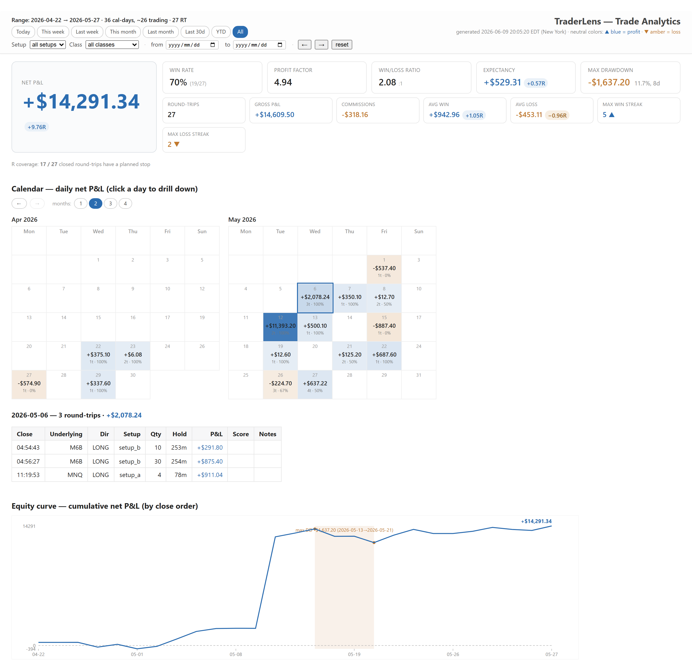
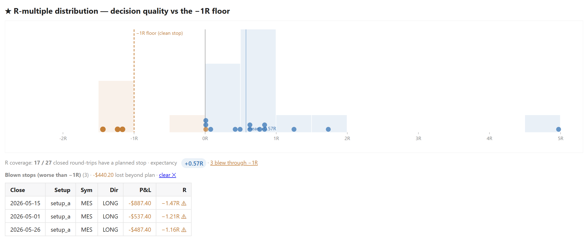
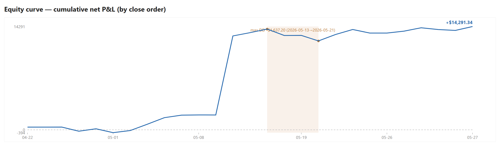
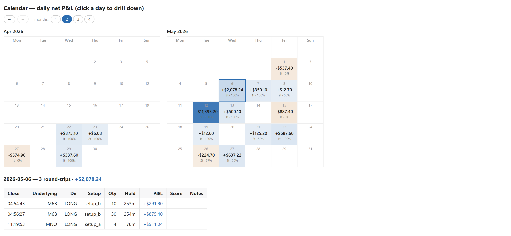
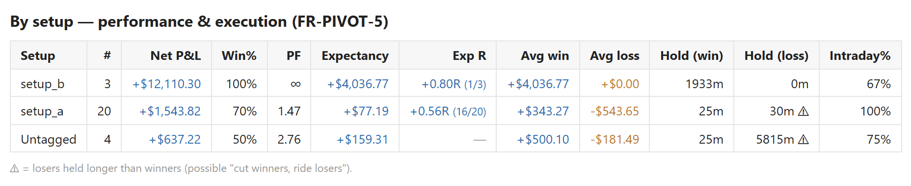
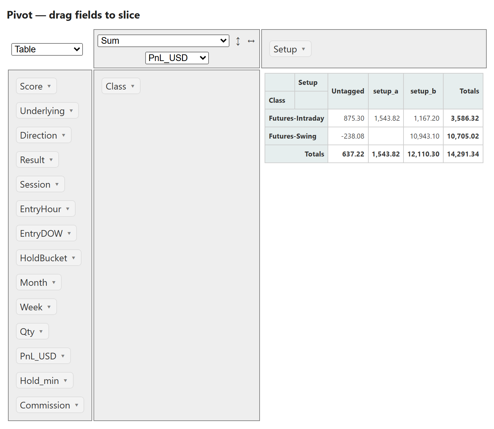
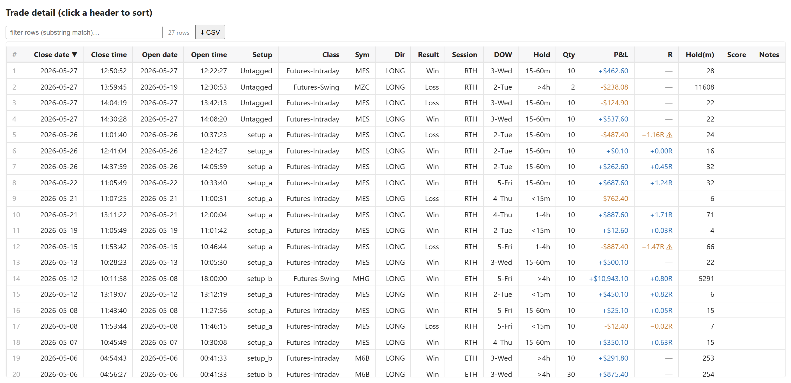

# TraderLens

**English** · [中文](README_cn.md)

**See your trading patterns clearly.** Turn your broker's trade
history into a single self-contained HTML report — equity curve,
calendar heatmap, per-setup scoring, R-multiple, drill-down detail —
all filter-linked, all offline, no server.



*Screenshot from the bundled [demo data](demo/) — 50 anonymised
trades.*

### R-multiple — is your edge real, and is your stop discipline holding?

Dollars hide two things: position size and risk discipline. Add the
**planned stop** you took a trade with, and TraderLens shows **R**
(profit ÷ planned risk) as a dimension across the whole report — plus
one focus chart with a **−1R floor**. Hover any trade; click the ones
that *blew through* their stop to see what the indiscipline cost, in
dollars. Optional and per-trade — no stop, no R, nothing in your way.



<details>
<summary><strong>More screenshots</strong> — equity curve · calendar heatmap · by-setup scoring · pivot · detail table</summary>

### Equity curve



### Calendar heatmap



### By-setup scoring



### Pivot table (Class × Setup slice)



### Detail table (filter-linked)



</details>

---

## Who is this for?

You trade through a broker that gives you a structured trade history
(Interactive Brokers today; more adapters welcome). At the end of
the week you find yourself asking:

- Which setups actually make money?
- When in the day am I most profitable?
- Did Tuesday's losses come from one bad session, or many small
  drips across the week?

Spreadsheets get you there — slowly. TraderLens answers those
questions in a single HTML file you can open in any browser, offline.

---

## Try the demo (zero setup)

**Double-click [`demo.html`](demo.html)** — that's it.

It's a self-contained HTML file (~440 KB, jQuery + PivotTable.js
inlined) generated from 50 anonymised trades. Opens in any
browser on any OS, works offline, runs no code, touches no other
file on your machine.

If you like what you see, jump to [Run it on your own data](#run-it-on-your-own-data).

Bundle details (the SQLite + CSV the HTML was generated from, plus
how the data was anonymised and how to re-run the pipeline locally):
[demo/README.md](demo/README.md).

---

## What you get

Five views, all rendered into one self-contained HTML file
(~400 KB, opens in any browser, works offline):

- **KPI block** — win rate, profit factor, drawdown, average / best /
  worst trade.
- **Equity curve** — cumulative P&L with date ticks and a drawdown
  band underneath.
- **Calendar heatmap** — daily P&L by date; click a day to drill in.
- **By-setup scoring** — how each of your tagged strategies actually
  performs.
- **Pivot + detail table** — drag-and-drop pivot (PivotTable.js) plus
  a sortable / filterable trade list, both reacting to the same
  filter state.

> Live version: [`demo.html`](demo.html) at the project root —
> just double-click.

---

## Run it on your own data

TraderLens v1 ships an adapter for **Interactive Brokers**, using
their read-only Flex Web Service.

**One-time setup** (~5 minutes):

1. Get a Flex token from IBKR Client Portal → Settings → Flex Web
   Service. You'll create one *Activity* query and (optionally) one
   *Trade Confirmation* query.
2. Copy `.env.example` to `.env` and fill in:
   ```
   IBKR_FLEX_TOKEN=...
   IBKR_FLEX_QUERY_ID=...
   ```
   `.env` is gitignored — never gets committed.

**Daily use** — one script per platform, both fetch + archive + rewrite the CSV:

- **Windows** — double-click [`scripts\run_ib_sync.bat`](scripts/run_ib_sync.bat)
- **macOS / Linux** — `bash scripts/run_ib_sync.sh` (already executable; or `./scripts/run_ib_sync.sh`)

**Make it automatic** (so you mostly forget about it):

- **Windows** — register a Windows Task Scheduler entry:
  ```powershell
  powershell -ExecutionPolicy Bypass -File scripts\register_ib_sync_task.ps1
  ```
- **macOS** — install a launchd agent:
  ```bash
  bash scripts/install-launchd-task.sh
  ```
- **Linux** — `cron` / `systemd` timer / `anacron` — your pick. Run
  `scripts/run_ib_sync.sh --no-delay --mode auto` on your preferred
  schedule. (A cron one-liner that fires every 4 hours:
  `0 */4 * * * /path/to/scripts/run_ib_sync.sh --no-delay --mode auto`.)

The HTML pivot gets refreshed when you want to annotate / re-score:
**Windows** — `scripts\review.bat`; **macOS / Linux** — `bash scripts/review.sh`.

Full operations manual (logs, exit codes, troubleshooting, all the
commands): [docs/guides/OPERATIONS.md](docs/guides/OPERATIONS.md).

> **Flex rate limit, please read once.** Interactive Brokers enforces
> a minimum 10-minute interval between Flex calls; abuse can get your
> IP permanently banned for *all* IBKR API access. TraderLens
> enforces this in code (10-min gate + 30-min penalty box, never
> blind-retries). Don't disable the gate — see [ADR-002](docs/decisions/002-flex-rate-limit-policy.md).

---

## Privacy and data ownership

**Everything stays on your machine.** TraderLens is local-first —
no author-run backend, no cloud service, no telemetry, no analytics,
no crash reporter. The author has no way to see your trades, account
number, Flex token, name, IP, or anything else. There is no "we" for
your data to go to.

What lives where (all on your machine, all gitignored):

- **Broker credentials** — `.env` (`IBKR_FLEX_TOKEN`,
  `IBKR_FLEX_QUERY_ID`).
- **Trade data** — `data/trades.sqlite`, `data/annotations.csv`,
  `data/exports/*.csv`, `data/state.json`.
- **HTML reports** — `reports/pivot_latest.html`.
- **Logs** — `logs/ib_sync_*.log`.

Every network connection TraderLens ever makes:

1. **Your machine → Interactive Brokers** Flex Web Service
   (`https://*.interactivebrokers.com/...`), authenticated with
   *your* Flex token, fetching *your* account's trades. Read-only.
2. `pip install -r requirements.txt` — only at setup, only to PyPI.

That's it. There is no item 3. If a future feature ever needs a
new network destination (e.g. an opt-in cloud annotation sync), it
will be documented here, opt-in, and disabled by default.

Third-party JavaScript bundled in the HTML pivot (jQuery, jQuery UI,
PivotTable.js) is **vendored locally** under `assets/vendor/` — the
report has no CDN dependencies and works fully offline.

---

## Roadmap

- **Pivot Tier-2** — export current filter as CSV, auto-regenerate
  after each sync, more cross-cuts.
- **Same-day capture** — capture today's fills after the close via
  the Trade Confirmation Flex query (alongside the existing T+1
  Activity feed).
- **More broker adapters.** TraderLens is broker-agnostic by design.
  IBKR is the first adapter, not the only intended one — the
  annotation layer, pivot, and export schema are broker-neutral;
  only the fetch + parse layer is per-broker. Adapters for other
  brokers (`coinbase_sync`, `td_sync`, `binance_sync`, …) are
  first-class welcome contributions.

---

## Status and limits

This is **alpha-quality software for personal record-keeping**. Not
financial advice. Not for automated trading. Always reconcile against
your broker's own statements before treating any number here as
truth.

**By using TraderLens you accept the terms in [DISCLAIMER.md](DISCLAIMER.md)**
— no warranty on data integrity, no liability for losses, and your
responsibility to comply with your broker's terms and your local laws.

v1 is tested against futures (NQ / MNQ / ES / MES) and stocks on a
US paper account. Other instrument classes (options, FX, crypto,
non-US markets) may produce incorrect results — the parser's
field-coverage assumptions were tuned for what was observed there.

---

## Architecture (skim if curious)

<details>
<summary><strong>60-second architecture overview</strong></summary>

```
 Broker (Interactive Brokers today)
        │
        │  Flex Web Service — read-only, two-step poll
        ▼
 Fetcher (Python, stdlib + requests)
        │
        ▼
 SQLite archive — every trade, idempotent
        │
        ├─▶ CSV export — schema-stable, machine-readable
        │
        └─▶ HTML pivot — one self-contained file for review
```

Three layers:

- **Fact** — immutable, broker-given. `data/trades.sqlite`, written
  only by the fetcher with `INSERT OR IGNORE`. Re-running is safe.
- **Annotation** — user-owned. `data/annotations.csv`, you fill
  `setup_tag` / `score` / `notes` in Excel; keyed by the opening
  leg's trade ID so it survives re-fetches and re-pairings.
- **Derived** — recomputable any time. The CSV exports and HTML
  pivot are pure functions of *fact + annotation*; delete and
  regenerate freely.

Stack: Python 3.10+, `requests` (the only runtime dep), stdlib
`xml.etree` for parsing, SQLite for storage. The HTML pivot inlines
jQuery + PivotTable.js (MIT) so the report works offline.

</details>

---

## License

TraderLens is licensed under [AGPL-3.0](LICENSE). The author retains
full copyright as the sole contributor; future dual-licensing
remains an option pending a CLA. Network-use reciprocity (per AGPL
§13) means a SaaS rehost would need to open-source its full stack.
Background: [ADR-003](docs/decisions/003-license-agpl-3.0.md).

Third-party assets vendored in `assets/vendor/` (jQuery, jQuery UI,
PivotTable.js) are MIT-licensed; full attribution in
[assets/vendor/README.md](assets/vendor/README.md).

---

## See also

- [DISCLAIMER.md](DISCLAIMER.md) — not financial advice, use at your
  own risk.
- [CONTRIBUTING.md](CONTRIBUTING.md) — how to file issues, branch
  and commit conventions, code review process.
- [CHANGELOG.md](CHANGELOG.md) — release notes.
- [docs/INDEX.md](docs/INDEX.md) — full documentation index
  (operations, ADRs, study spikes).
